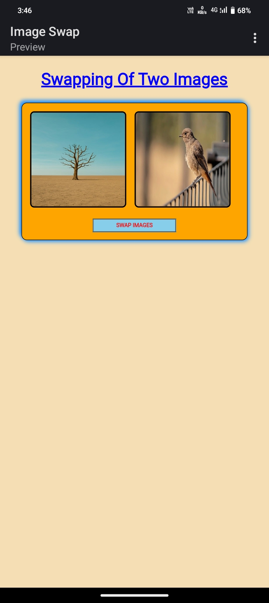
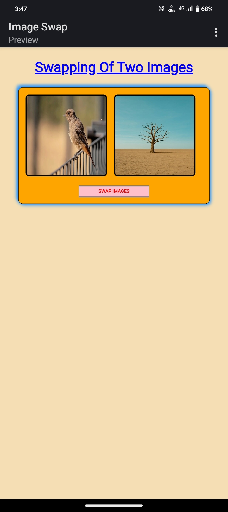

# 🔄 Image Swap with JavaScript

A simple JavaScript project to demonstrate how to swap two images when a button is clicked. Great for beginners learning DOM manipulation!

## 👩‍💻 Web Technologies used

 1. JavaScript
 2. HTML
 3. CSS

## 🚀 Features

- Pure JavaScript (no libraries)
- Easy to understand and customize
- Works on all modern browsers

## 🧩 How It Works

Two `` elements are targeted via their `id`s. A button triggers the swap by switching the `src` attributes of the two images.

## 🗂️ File Structure

image-swap/ ├── index.html ├── script.js ├── image1.jpg ├── image2.jpg └── README.md

## 🛠️ Usage

1. **Clone the repo:**

   git clone https://github.com/shravanithouta108/2-images-swap.git
   cd image-swap

2. Add your own images: Replace image1.jpg and image2.jpg with your own images in the root directory.

3. Open in browser: Open index.html in your browser.

## 📸 Preview 
Before Swap: 

After Swap:

## 📄 License

MIT License. Feel free to use, modify, and share.

## 👨‍💻 Created with ❤️ by Shravani Thouta 
